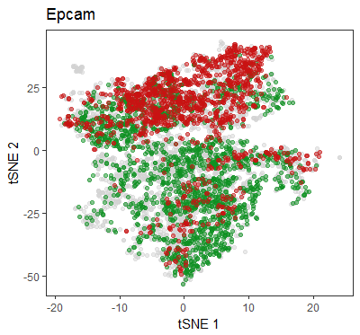
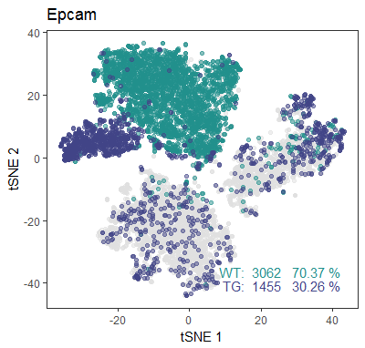
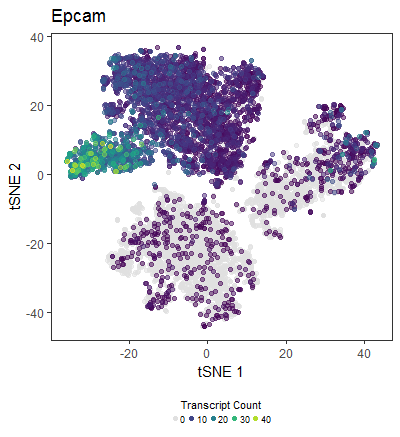
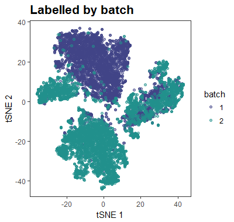
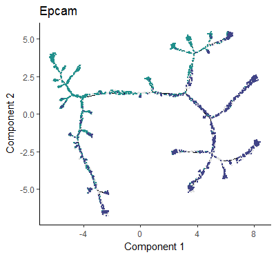

# kelvinny
Kelvin's wrapper scripts for R ggplot2 plotting functions

## Installation instructions
You can install the package via ```devtools::install_github()``` function in R
```R
library(devtools)
devtools::install_github('zktuong/kelvinny')
```
## Usage instructions
```R
library(kelvinny)
```
The package contains a couple of wrapper functions for plotting in R, mostly revolving around the use of ggplot2. I will update the package as i start writing more. use ?functionname to find out more options that each function can take.

### simple.tSNE
A simple function to overlay colours onto tSNE plots. It is currently written to accept a gene name and plot which cells express at least 1 transcript and separate the colours depending on the sample type.
```R
simple.tSNE('Epcam')
```

### ascendtSNE
An altered version of simple.tSNE to work with data from ascend. 
```R
ascendtSNE.gene('Epcam')
```

```R
ascendtSNE.gene('Epcam', heat=TRUE)
```


```R
ascendtSNE.info('batch') # only accepts 'batch' or 'cluster' at the moment
```


### colorMyTrajectory
Overlays what the simple.tSNE plot does in terms of coloring, onto the Monocle pseudotime trajectory generated with their CellDataSet (called HSMM in the tutorial).
```R
colorMyTrajectory('Epcam') 
```

