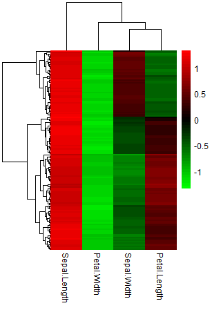

# kelvinny
Kelvin's wrapper scripts for R plotting functions and other stuff.

## Installation instructions
You can install the package via ```devtools::install_github()``` function in R
```R
library(devtools)
devtools::install_github('zktuong/kelvinny', dependencies = TRUE)
```
## Usage instructions
```R
library(kelvinny)
```
The package contains a couple of wrapper functions for plotting in R, mostly revolving around the use of ggplot2, pheatmap and viridis etc. I will update the package as i start writing more. use ?functionname to find out more options that each function can take.
The plotHeat function has a small tutorial on how to generate some basic heatmaps. 

### plotHeat
A shortcut to plotting heatmaps, provided the table you want to plot can be uploaded into R.
```R
data <- read.delim("table.txt") # a typical way to load a tab-delimited text file
# or in this specific example, i'm using a data table that is already preloaded in R
data(iris)
head(iris)
data <- iris[,1:4] # i'm removing the last column because it's not numeric
plotHeat(data, col = "RdWhBlu")
```

```R
plotHeat(data, col="viridis")
```

```R
plotHeat(data, col=c("green","black","red"))
```


plotHeat will take additional arguments from pheatmap. So, using example for pheatmap: 
```R
test = matrix(rnorm(200), 20, 10)
test[1:10, seq(1, 10, 2)] = test[1:10, seq(1, 10, 2)] + 3
test[11:20, seq(2, 10, 2)] = test[11:20, seq(2, 10, 2)] + 2
test[15:20, seq(2, 10, 2)] = test[15:20, seq(2, 10, 2)] + 4
colnames(test) = paste("Test", 1:10, sep = "")
rownames(test) = paste("Gene", 1:20, sep = "")
# Generate annotations for rows and columns
annotation_col = data.frame(
  CellType = factor(rep(c("CT1", "CT2"), 5)),
  Time = 1:5
)
rownames(annotation_col) = paste("Test", 1:10, sep = "")
annotation_row = data.frame(
  GeneClass = factor(rep(c("Path1", "Path2", "Path3"), c(10, 4, 6)))
)
rownames(annotation_row) = paste("Gene", 1:20, sep = "")
# plot
plotHeat(test, annotation_col=annotation_col, annotation_row=annotation_row)
```

```R
plotHeat(test, annotation_col=annotation_col, annotation_row=annotation_row, col="viridis")
```


### gg_color_hue
Generates the standard colors used by ggplot.
```R
gg_color_hue(20)
#  [1] "#F8766D" "#EA8331" "#D89000" "#C09B00" "#A3A500" "#7CAE00" "#39B600" "#00BB4E" "#00BF7D" "#00C1A3" "#00BFC4" "#00BAE0" "#00B0F6"
# [14] "#35A2FF" "#9590FF" "#C77CFF" "#E76BF3" "#FA62DB" "#FF62BC" "#FF6A98"
```

### pbcopy/pbpaste
pbcopy lets you copy any object from R to paste outside as a dataframe/vector as you wish.
```R
pbcopy(data)
```
pbpaste does the reverse: converts what you copy outside and paste as a vector in R.
```R
pasted_data <- pbpaste()
```

### RFclassifier/RFpredictor
Uses RandomForest algorithm to classify data, for example seurat single-cell data
```R
# library(kelvinny)

classifier <- RFclassifier(train.seurat, training.classes = train.seurat@ident, importance = "impurity", probability = TRUE)
prediction <- RFpredictor(classifier, as.matrix(test.seurat@data))

## plot this as a heatmap:
prediction_mat <- prediction$predictions
test.seurat.metadata <- cbind(test.seurat@meta.data, prediction$predictions)
test.seurat.metadata <- test.seurat.metadata[order(test.seurat.metadata$combined.clusters), ]

library(viridis)
plotmat <- t(test.seurat.metadata[,9:ncol(test.seurat.metadata)])
colAnno <- test.seurat.metadata[,c(5,7,8)]

library(paletteer)
palette <- paletteer_d(package = 'rcartocolor', palette = 'Vivid', 12)

RF_class <- gg_color_hue(15)
names(RF_class) <- levels(test.seurat.metadata$RF_class)[-4]
combined.clusters <- palette
names(combined.clusters) <- levels(test.seurat.metadata$combined.clusters)
protocol <- viridis::viridis(2)
names(protocol) <- unique(test.seurat.metadata$protocol)

anno_color <- list(RF_class = RF_class, combined.clusters = combined.clusters, protocol = protocol)

plotHeat(plotmat, color = inferno(50), scale = "none", annotation_col = colAnno, annotation_colors = anno_color, cluster_rows = TRUE, cluster_cols = FALSE, show_colnames = FALSE)
```


### train_model_glmnet/test_model_glmnet
Uses glmnet algorithm to predict data.
```R
model <- train_model_glmnet(data, variable_colname = "disease", alpha = 0.5, cutOff = 0.5, nfolds = ncol(data)) # LOOCV Elastic net regularization
pred <- test_model_glmnet(model = model, new_data = newdat, type = "link")
```

### trainScSimilarity/predScSimilarity
Similar to above. Uses glmnet algorithm to predict similarity of cells to reference/training data.
Requires objects provided as SingleCellExperiment/SummarizedExperiment objects.
```R
model <- trainScSimilarity(train.sce, colData(train.sce)$CellType, nfolds = dim(train.sce)[2])
pred <- predScSimilarity(model, test.sce)
```

